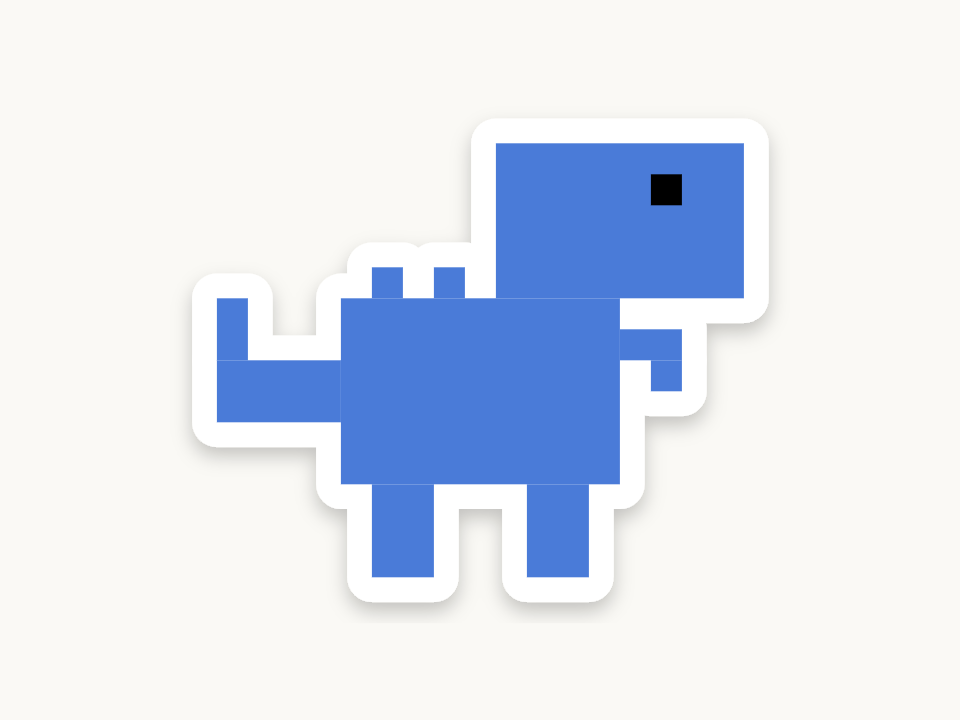

<p align="center">
  
</p>

<h1 align="center">Gabo</h1>
<p align="center"><strong>A multi-agent harness that runs on your own machine.</strong><br />
A team of twelve role agents works together in rooms built for studying, brainstorming and shipping software.</p>

---

Gabo is a local web app built on the [Claude Agent SDK](https://code.claude.com/docs/en/agent-sdk/overview). It works like a
terminal coding agent (tools, permissions, slash commands, history, plugins, skills, MCP servers), and adds a team of
role agents who hand work to each other, challenge each other and build on each other's output.

It runs on the AI account you connect: a **Claude**, **OpenAI** or **Gemini** API key, or a free **local model** in Ollama.

## Features

- **Twelve agents with distinct roles:** Believer, Skeptic, Investor, Judge, Designer, Coder, Tester, Researcher, Tutor, Caveman, Planner and Emperor. Each has a pixel mascot and its own stage.
- **Rooms where the team works together:**
  - **Library** (study and research)
  - **Arena** (brainstorm and pick the best idea, with an idea tournament)
  - **Hackathon** (plan, design, build, test, ship)
  - **Laboratory** (you pick the team)

  In every room, agents answer each other's points and pass work along, and the chat shows who builds on whom.
- **Your own agents:** describe an agent and generate its costume and background, or pick each part yourself.
- **CLI-style console:**
  - permission prompts and plan approval
  - permission modes (Shift+Tab)
  - model and effort pickers
  - `/` commands and `@` file mentions
  - pasted images
  - a todo list and edit diffs
  - message queueing and Esc to stop
  - **New Session**, which runs `/compact` on a copy of the chat and continues in a new one
- **History and pins:** every session, from the app and from the terminal, resumable.
- **Connect any AI:**
  - Claude with an API key, natively
  - OpenAI and Gemini through a built-in Anthropic-to-OpenAI translator
  - a Local LLM in Ollama
- **Local LLM mode:**
  - a setup guide, one-click model preparation (context window) and a tool-call test
  - a readiness checklist
  - a slim prompt, so small models stay fast
  - skills picked offline
  - plugins you choose: GitHub, Notion, Obsidian, or any MCP server
- **Token budget:** recommended model, effort, tools and output length per agent, in Economy, Balanced or Max mode. See [docs/token-budget.md](docs/token-budget.md).
- **Status page:** usage, connectivity, MCP servers, plugins and versions.

## Requirements

- **Node.js 20.9 or newer**, tested on Node 24.
- An AI account to connect: a Claude, OpenAI or Gemini **API key**, or [Ollama](https://ollama.com/download) for local models.
- **Python 3.8 or newer**, only for the Arena's idea tournament.

## Quick start

```bash
git clone https://github.com/Gabi-comm/Gabo.git
cd Gabo
npm install
npm run dev
```

Open **http://127.0.0.1:3217**. After the intro, a pop-up asks you to connect:

- **Connect:** pick Claude, OpenAI or Gemini. Gabo opens the provider's sign-in page so you can create an API key. Paste the key, and Gabo checks it before saving. Usage is billed by the provider to your account.
- **Use Local LLM:** opens the Local LLM page and walks you through installing Ollama, downloading a model that can use tools (for example `qwen3:8b`), preparing it and switching it on. Nothing leaves your computer.

You can change the connection any time under **Connect AI** in the sidebar.

> Subscription logins (Claude Pro/Max, ChatGPT Plus, Gemini) can't be offered by third-party apps: Anthropic's Agent SDK
> terms don't allow offering claude.ai login in other products, and OpenAI and Google only offer subscription login in their
> own tools. That's why Gabo connects with API keys or a local model.

## Using it

| Where | What |
| --- | --- |
| **Home** | A normal single-agent session. It answers directly and calls the Caveman only when asked. |
| **Workspace → Library / Arena / Hackathon / Laboratory** | Team rooms: the lead picks the fitting agents for your prompt and runs them in order, with hand-offs. |
| **Agents** | Every agent on its stage. Open one for a solo chat. |
| **Settings** | Edit each agent's role and goal, pick its model and effort, set the token budget, and create your own agents. |
| **Plugins** | Let the agents consult other AIs (ChatGPT, Gemini, OpenClaw, Hermes or any OpenAI-compatible server), and see your installed plugins. |
| **Local LLM** | Ollama setup, model preparation and tests, readiness, and the plugins the local model may use. |
| **Status** | Connection, usage, connectivity, MCP servers and versions. |

The full feature and command reference is in [document.md](document.md).

## Scripts

| Command | Does |
| --- | --- |
| `npm run dev` | Start Gabo at http://127.0.0.1:3217 |
| `npm run build` then `npm start` | Production build and server |
| `npm test` | Unit tests (Vitest) |
| `npm run test:e2e` | Browser tests (Playwright) against a scripted fake mode, no AI account used |
| `npm run typecheck` | TypeScript check |

## Privacy and safety

- The server listens on **127.0.0.1** only, and every API route rejects requests from other hosts and origins.
- File tools are locked to the workspace folder you pick, plus any folder you connect (such as an Obsidian vault). Writes, edits and shell commands ask first.
- Keys and chats stay in `.data/`, which is git-ignored. Keys are never sent back to the browser.
- The OpenAI/Gemini translator only accepts requests carrying a secret that changes on every server start.

## Project layout

```text
src/
  app/            Next.js pages and API routes (run, connect, translate, local-llm, connectors, …)
  components/     UI: console, shell, rooms, mascots, settings, connect, local LLM
  harness/        The engine, no React: agents, rooms, runner, events, budget, translator, connectors, skills
  server/         Server-only stores and checks: sessions, keys, connection, connectors, usage, status
docs/             Spec, plans and decisions (spec.md is the binding spec for agent roles)
config/           Agent overrides and custom agents (tracked)
vendor/idea-arena The Arena's tournament skill (MIT, pinned)
tests/e2e/        Playwright tests
```

## Docs

- [document.md](document.md): every page, key, command and file
- [docs/spec.md](docs/spec.md): the original spec, with each agent's role
- [docs/token-budget.md](docs/token-budget.md): why each agent runs on the model it does
- [docs/plan-local-llm-tools.md](docs/plan-local-llm-tools.md): Local LLM skills and plugins, with measurements
- [docs/plan-token-reduction.md](docs/plan-token-reduction.md): research behind the token savings
